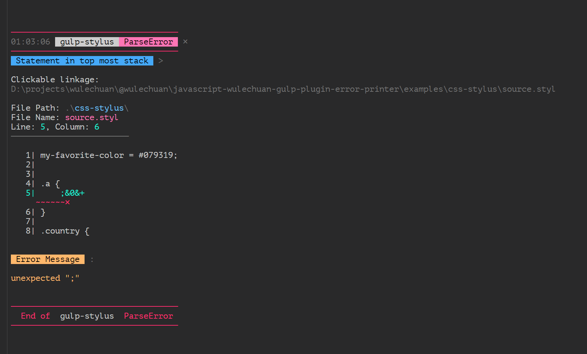
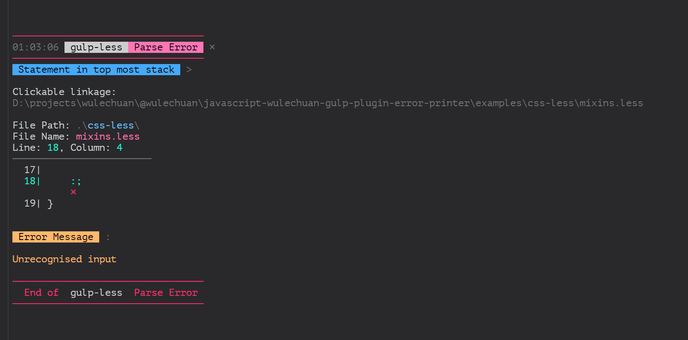
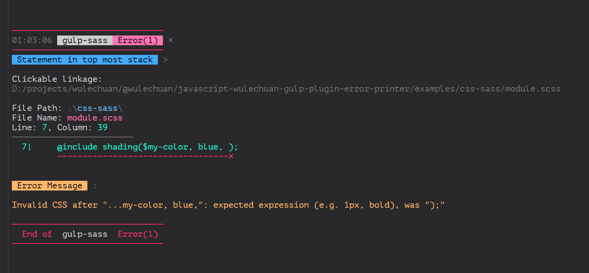
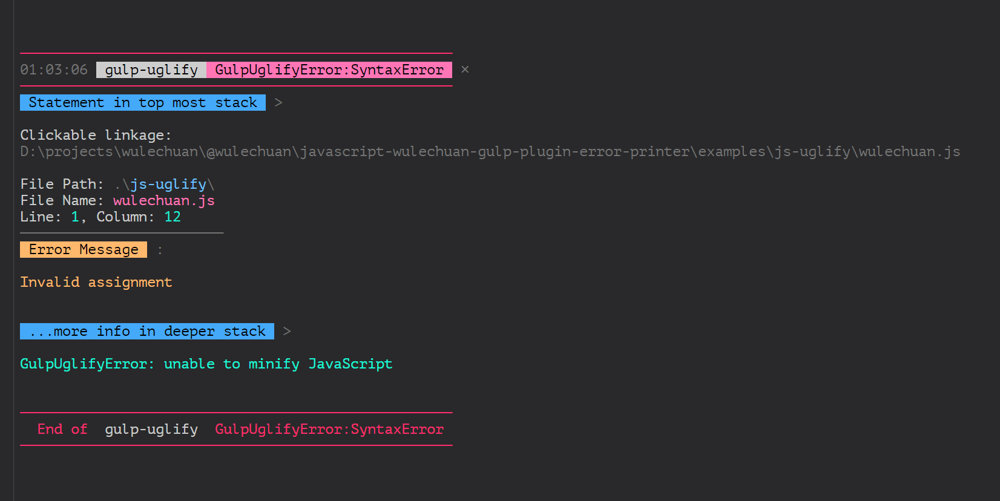

# Wulechuan's Printer For Errors of Glup Plugins

## NPM Page

<dl>
<dt>Package Name</dt>
<dd>

[@wulechuan/printer-for-errors-of-gulp-plugins](https://www.npmjs.com/package/@wulechuan/printer-for-errors-of-gulp-plugins)


</dd>
<dt>Author</dt>
<dd><p>南昌吴乐川</p></dd>
</dl>


## Introduction

This package is renamed from [@wulechuan/javascript-gulp-plugin-error-printer](https://www.npmjs.com/package/@wulechuan/javascript-gulp-plugin-error-printer), as the old name is not so good.

This is a message logging tool for [gulp](https://gulpjs.com/).
It parses gulp's [PluginError](https://github.com/gulpjs/plugin-error) instance,
and is expected to print a more beautiful log for the error instance,
as long as a parser is provided for that specific type of PluginError.

Almost all colors in the logs are configurable.


### Supported Plugins So Far

* [gulp-uglify](https://www.npmjs.com/package/gulp-uglify)
* [gulp-stylus](https://www.npmjs.com/package/gulp-stylus)
* [gulp-less](https://www.npmjs.com/package/gulp-less)
* [gulp-sass](https://www.npmjs.com/package/gulp-sass)
* [gulp-postcss](https://www.npmjs.com/package/gulp-postcss)

Even for those errors that are not supported,
a beautified property list is logged.


## Usage

### An Example

See the `examples/gulpfile.js` included by this repository as an example.

Below are the key snippet from the said `gulpfile.js`.

```javascript
const printGulpPluginErrorBeautifully = require('@wulechuan/printer-for-errors-of-gulp-plugins');

const exampleSourceFileBasePath = '.';

const errorOfGlupPluginsPrintingConfigurations = {

    // This simply helps the logger print shorter paths
    // so that file paths looks better in narrow console windows.
    basePathToShortenPrintedFilePaths: exampleSourceFileBasePath,

    colorTheme: {
        heading: {
            lineColor: 'magenta',
        },
    },
};


function buildCSSStylus (cb) {
    return gulpRead(sourceGlobsOfCSSStylus)
        .pipe(compileStylus())
        .on('error', theError => {
            printGulpPluginErrorBeautifully(theError, errorOfGlupPluginsPrintingConfigurations);
            cb();
        });
}
```


### An Example with `gulp-pipe`

The tasks in the new gulp (gulp 4), will throw as early as possible. So we have to handle the errors of each and every gulp-plugin like this.

> At least that's the approach I know so far.

```js
const printGulpPluginErrorBeautifully = require('@wulechuan/printer-for-errors-of-gulp-plugins');
const gulpPipeFromArray = require('gulp-pipe');


function aGulpTask() {
    const pipeSegments = [ gulp.src(sourceGlobs) ]


    // ---------------------------------------------------------------

    if (shouldEnableStylus) {
        const pipeInstance = stylus()

        // handle the error specific to "stylus".
        pipeInstance.on('error', theError => {
            printGulpPluginErrorBeautifully(theError, {
                basePathToShortenPrintedFilePaths: '../',
            })

            // Don't forget to end this pipe if an error occurs.
            // Otherwise, when used with gulp watcher,
            // the watcher gets hung for ever if this error occurs.
            pipeInstance.end()
        })

        pipeSegments.push(pipeInstance)
    }

    // ---------------------------------------------------------------


    if (shouldEnableAnotherPlugin) {
        const pipeInstance = anotherPlugin()

        // handle the error specific to this "anotherPlugin".
        pipeInstance.on('error', theError => {
            printGulpPluginErrorBeautifully(theError, {
                basePathToShortenPrintedFilePaths: '../',
            })

            // Don't forget to end this pipe if an error occurs.
            // Otherwise, when used with gulp watcher,
            // the watcher gets hung for ever if this error occurs.
            pipeInstance.end()
        })

        pipeSegments.push(pipeInstance)
    }


    pipeSegments.push(gulp.dest('./dist/css/'))


    return gulpPipeFromArray(pipeSegements)
}
```


### Try It out, See It in Action

There is a dummy project included within this repository,
so that people can try this logger without difficulty.

The said dummy project locates here:

```sh
<this repository root folder>/examples
```


#### Before You Try

Before you can start trying,
you first need to install all dependencies for this npm project.

> This is a one time action, you don't need to do it
> every time before you run the tryout script.

Open a console/terminal and run:

```sh
npm install
```

or even simpler:

```sh
npm i
```

#### Run the Tryout Script

Open a console/terminal and run:

```sh
npm start
```

or even simpler:

```sh
gulp
```

That's it.


#### Some Snapshots of Mine

Below are some snapshots of my console,
hosted within Microsoft [Visual Studio Code](https://code.visualstudio.com/).

> By the way, the used color theme of my Visual Studio Code,
> shown in the illustrates below,
> is the "[Panda Theme](http://panda.siamak.work/)".

A Stylus compilation error.


A LESSCSS compilation error.


A Sass compilation error.


An UglifyJS parsing error.



### Configurations

Currently only colors are configurable. So you may call it "color theme configurations" if you prefer.

See [configurations.md](./docs/configurations.md).


## Known Issues

When utilizing the `on('error')` method of a gulp's pipeline,
the error will propagate outside the event handler,
and will finally get printed the traditional way.
Since this logger also prints the error, the error is printed **twice**.

I'll learn how to *swallow* the error inside this logger in the future.


## API

Sorry. I don't have too much spare time at present.
I have my boy to take care of.

Consult my *ugly* source codes if you'd like to. :p
